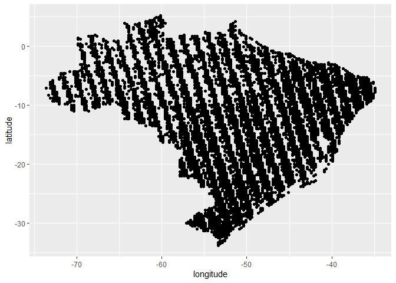

<!-- README.md is generated from README.Rmd. Please edit that file -->

# fco2r

<!-- badges: start -->
<!-- badges: end -->

The goal of fco2r is to …

## Installation

You can install the released version of fco2r from
[CRAN](https://CRAN.R-project.org) with:

``` r
install.packages("fco2r")
```

And the development version from [GitHub](https://github.com/) with:

``` r
# install.packages("devtools")
devtools::install_github("arpanosso/fco2r")
```

## Example

This is a basic example which shows you how to solve a common problem:

``` r
library(fco2r)
## basic example code
```

``` r
oco2_br <- readr::read_rds("C://GitHub//fco2r//data-raw//oco2_br.rds")
dplyr::glimpse(oco2_br)
#> Rows: 146,646
#> Columns: 11
#> $ longitude                              <dbl> -70.33963, -70.33963, -70.33963~
#> $ longitude_bnds                         <chr> "-70.4644097222:-70.21484375", ~
#> $ latitude                               <dbl> -5.806417, -5.557240, -5.058887~
#> $ latitude_bnds                          <chr> "-5.93100534001:-5.68182872924"~
#> $ time_yyyymmddhhmmss                    <dbl> 2.014092e+13, 2.014092e+13, 2.0~
#> $ time_bnds_yyyymmddhhmmss               <chr> "20140915000000:20140916000000"~
#> $ altitude_km                            <dbl> 3307.8, 3307.8, 3307.8, 3307.8,~
#> $ alt_bnds_km                            <chr> "0.0:6615.59960938", "0.0:6615.~
#> $ fluorescence_offset_relative_771nm_idp <dbl> 0.0167236, 0.0187703, 0.0167454~
#> $ fluorescence_offset_relative_757nm_idp <dbl> 0.01495360, 0.01348060, 0.01151~
#> $ xco2_moles_mole_1                      <dbl> 0.000391583, 0.000394184, 0.000~
```

``` r
oco2_br |>
  dplyr::sample_n(20000) |>
  ggplot2::ggplot(ggplot2::aes(x=longitude, y=latitude)) +
  ggplot2::geom_point()
```


